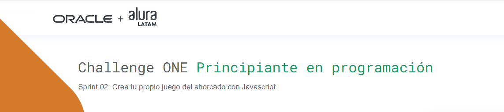
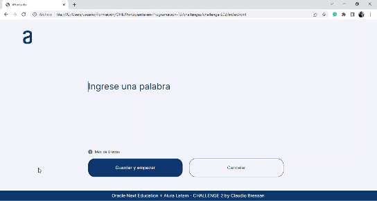

 
   
   
   

---

## Descripción
#### El objetivo de este segundo challenge es terminar de poner en práctica lo aprendido en la primer estapa del programa **ONE**.
---
## Funcionalidades
  
 - **`agregar palabras`**: permite al usuario agregar una nueva palabra para que juegue otra persona, esta palabra es incorporada a la lista de palabras predefinidas.  

   
 - **`jugar`**: permite jugar al tradicional juego del ahorcado con una lista de palabras predefinidas, de las cuales se elije una aleatoriamente.
 

##### en este proyecto a las habilidades empleadas en el Challenge 01, se agrega el manejo de CANVAS desde JavaScript.

&nbsp;
### Puedes acceder al site, haciendo clic [**aquí**](https://Claubress.github.io/ONE-Alura-Challenge02/)
---
## Tecnologías utilizadas

---
## Autor
[ Claudio Bressan](https://github.com/Claubress) |
 :---: |

